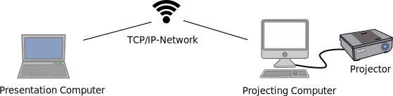
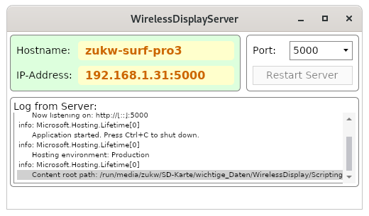
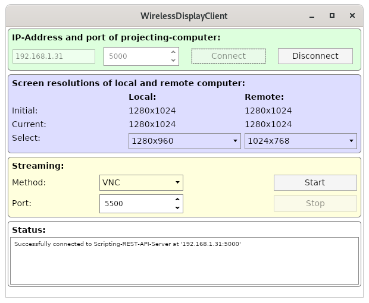

# WirelessDisplay

## Overview

With the projects in this repository the display-content of a 
'presentation-computer' can be streamed via a WLAN to a 'projecting-computer'. 
The projecting-computer is connected to a projector and displays the streamed 
content using the projector.



On the presentation-computer the GUI-program 'WirelessDisplayServer' is 
started. Its main-purpose is to show the IP-address of the presentation-
computer, and to start a webservice in backgorund.



On the projecting-computer another GUI-program, called 'WirelessDisplayClient'
is started. This GUI-program is used to connect to the presentation-computer,
and start/stop the stream. The GUI also allows to control the 
screen-resoltutions of both computers.



Linux, macOS and Windows are the supported operating-systems for both 
computers (for now, Linux and Windows work. For macOS the scripts have
still to be written). As GUI-framework the platform-independent 
[Avalonia-Framework](http://avaloniaui.net) is used.

## The projects in this repository

This repository contains projects for three programs, written in C# using 
dotnet core 3.1:

- ScriptingRestApiServer
- WirelessDisplayServer
- WirelessDisplayClient

The programs 'ScriptingRestApiServer' and 'WirelessDisplayServer' run on the
projecting-computer. The program 'WirelessDisplayClient' runs on the 
presentation-computer.

The heart of the project is the 'ScriptingRestApiServer'-project, running
on the server. This project is a webservice that provides a REST-API. With
the REST-API the client (presentation-computer) is able to start and stop
the execution of scripts on the server (projecting-computer) via POST-Requests
to the webservice. There are scripts for 

- managing the screen-resolution, 
- preventing the display from turning off,
- start the streaming sink on the projecting-computer.

The program 'WirelessDisplayClient' runs on the presentation-computer. The user
can "connect" to the webservice on the projecting-computer, and start the
streaming. When the streaming is started by the user, th e following things
happen:

- The screen-resolution of the local computer (presentation-computer) is
  set to the desired value, running the script for managing the 
  screen-resolution on the local computer.
- The screen-resolution of the remote computer (projecting computer) is
  set to the desired value, by asking the remote-computer via a POST-request
  to run the script for managing the screen-resolution.
- With another POST-request the remote-computer is instructed to run a script
  that prevents the display from blanking.
- With another POST-request, the remote-computer is asked to execute a script
  that starts a streaming-sink.
- On the local computer a script is started, that runs a streaming-source.

## Scripts

To ensure platform-independency, the "real work" is done by scripts. On a 
Linux-Computer the scripts in the folder [Scripts/Linux] are executed with
`bash`, on Windows the batch-files in [Scritps/Windows] are executed with
`cmd.exe`. The file-name of the scripts, and the command-line arguments they 
receive, are the same for each operating-system. Only the file-extension and
the used shell are different for each operating-system.

Feel free to modify the scripts to your needs.

See the [REAMDE.md](Scripts/README.d) in the [Scripts]-Folder for more
information.

## Folder-structure

The folder [ScriptingRestApiServer] contains the source-code of the 
ScriptingRestApiServer-project. The folders [WirelessDisplayServer] and
[WirelessDisplayClient] contian the source-code of the other two projects.

The folder [Common] contains a class-library, that provides classe, that are
used by all three projects.

The folders [Scripts/Linux], [Scripts/macOS] and [Scripts/Windows] contain
the scripts that do all the relevant work. Some scripts rely on 
third-party-programs, which have to be present in [ThirdParty/macOS] and
[ThirdParty/Windows]. (On Linux only common programs are called by the
scripts). 

See the [README.md] in the folder [ThirdParty] and its subfolders for details.

The folders [ScriptingRestApiServer_executable], 
[WirelessDisplayServer_executable] and [WirelessDisplayClient_executable] are
empty and will contain the executable programs after building them.

## Installation instructions for the projecting-computer (server)

On the server-computer the programs (projects) 'ScriptingRestApiServer' and 
'WirelessDisplayServer' have to be built. The scripts in the [Scripts]-folder 
and eventually necessary third-party-programs must be present.

### Build-instructions for the projecting-computer using Windows

Assuming, that the dotnet-core 3.1-runtime is installed on the target-
Windows-computer used as projecting-computer, you can use the following
build-instructions:

- Download and extract, or clone the WirelessDisplay-repository. Then `cd` into
  the [WirelessDisplay]-folder

- Build the ScriptingRestApiServer-project (in a powershell):
```
cd ScriptingRestApiServer
dotnet publish -c Release -r win-x64 --self-contained false -o ../ScriptingRestApiServer_executable
cp config.json ../ScriptingRestApiServer_executable/
cd ..
```

- Build the WirelessDisplayServer-project (in a powershell)
```
cd WirelessDisplayServer
dotnet publish -c Release -r win-x64 --self-contained false -o ../WirelessDisplayServer_executable
cp config.json ../WirelessDisplayServer_executable/
cd ..
```

- Third-Party-executables must be made available in [ThirdParty/Windows]:
  * ffmpeg
  * VNC open
  * screenres.exe
  * PreventTurnOffDisplay.exe
  See [ThirdParty/Windows/README.md] for instructions to download these
  executables and put them into the correct folders.

- The following folders can now be copied to the target-computer:
  * [ScriptingRestApiServer_executable]
  * [WirelessDisplayServer_executable]
  * [ThirdParty], where only the subfolder [ThirdParty/Windows] is relevant.
  * [Scripts], where only [Scripts/Windows] is relevant.

The program can be started by double-clicking the executable file
[WirelessDisplayServer_executable/WirelessDisplayServer.exe]. A link to this
executable can be made on the Desktop or in the start-menu.


### Build-instructions for the presentation-computer using Linux

If dotnet core 3.1 (at least the runtime) is installed on the 
target-Linux-computer, you can use the following build instructions:

- Download and extract, or clone the WirelessDisplay-repository. Then `cd` into
  the [WirelessDisplay]-folder

- Build the WirelessDisplayServer-project (in a terminal type):
```
cd WirelessDisplayClient
dotnet publish -c Release -r linux-x64 --self-contained false -o ../WirelessDisplayClient_executable
cp config.json ../WirelessDisplayClient_executable/
cd ..
```

- On Linux no third-party-executables are necessary, but for the 
  presentation-computer `xrandr`, `x11vnc` and `ffmpeg` must be available:

  `xrandr` should be present on every Linux-system (using Xorg). On a 
  debian-based system the needed programs can be installed by

```
sudo apt-get install x11vnc 
sudo apt-get install ffmpeg libavcodec-extra
```

The script for streaming uses a H264-codec for ffmpeg-streaming, so 
the package libavcodes-extra is necessary. On Fedora, this codec is
part of the rpmfusion-free repository.

Note: `xdotool` and a `tigervnc-viewer` are only necessary on the 
projecting-computer. For a Linux-projecting-computer they can be easily 
installed using the package-manager.

- Since on Linux no third-party-programs are necessary, only the following
  two folders need to be copied to the target-computer:

  * [WirelessDisplayClient_executable]
  * [Scripts], where only [Scripts/Linux] is relevant.


The program can be started by the following commands. It is important to start 
the program from its directory, since it searches a 'config.json' in the current
working directory:

```
cd pathToWirelessDisplay/WirelessDisplayClient_executable
./WirelessDisplayClient
```

An equivalent .desktop-file or a shell-script containing these two commands 
can be created. 

### Options for building

There are three options for building (publishing) a dontet core 3.1 program:

- When using `dotnet publish` with `-r win-x64 | linux-x64 | osx-x64` and
  with `--self-contained false` a program is compiled for the given 
  operating system, and the dotnet core 3.1 - runtime must be installed on
  the target computer. If it is not isntalled, when starting the program,
  the user is notified and redirected to a download-page for the runtime.
  This option requires least disk-space. In the dotnet-core-world this
  is called a 'Framework-dependent executable'.

- When using `dotnet publish` without the `r-` option and with 
  `--self-contained false` a platform-independent program is created, but the 
  the dotnet core 3.1 - runtime must be installed on the target computer.
  This requires more disk-space than the first option. This is called
  'Framework-dependent deployment'.

- When using `dotnet publish` with `-r win-x64 | linux-x64 | osx-x64` and
  with `--self-contained true` an executable for the given operating system
  is compiled. This program runs on target-computers, which don't have the
  dotnet-core-3.1-runtime installed. This option requires most disk-space.

If a Raspberry pi is used as target computer the parameter for the `-r` option
is either `linux-arm` or `linux-arm64`, depending on the used 
Linux-distribution for the Raspberry pi.

See [Publish .NET Core apps with the .NET Core CLI](https://docs.microsoft.com/en-us/dotnet/core/deploying/deploy-with-cli)
and [.NET Core RID Catalog](https://docs.microsoft.com/en-us/dotnet/core/rid-catalog)
for more information.

## Configuration

Each of the trhee projects contains a file named [config.json]. When publishing
this file is manually copied to the directory of the executable. This file
has four 'sections', called:

- "PlatformIndependent"
- "Linux"
- "macOs"
- "Windows"

Each program searches for keys in the "PlatformIndependent"-section and in the
section for the operating-system the program is running on.

The keys are hard-coded and must not be changed (if you are interested, see 
[Common/MagicStrings.cs] for the keys).

The values can be changed, without the need to recompile the program.

The most interesting values are given below:

### Configuration of WirelessDisplayServer

The value of "PortNumbers" is a comma-separated list of port-numbers. These
port-numbers are put as items into the ComboBox of the GUI, and the user
can choose one of it. The ScriptingRestApiServer listens on the chosen port.

Normally the first port-number in the list is pre-selected and the
ScriptingRestApiServer is started using this port. If a user always chooses
one special port (for example 80 or 5000), then she can put this port as 
the first in the list.

### Configuration of WirelessDisplayClient

The values for the keys "PreferredServerPort" and "PreferredStreamingPort"
in [WirelessDisplayClient/config.json] are the startup-values in the
corresponding NumberUpDown-Fields of the WirelessDisplayClient-GUI.

Note, that the values are also given as strings. All values in [config.json]
must be strings.

The key-value-pair `"StreamingTypes" : "VNC, FFmpeg"` has as value a 
comma-separated list of supported streaming-types. These streaming-types
are the items of the corresponding ComboBox of the GUI. The selected value
is passed as first command-line-argument to the startStreamingSource- and
startStreamingSink-scripts. The first value in the list is the one that is
preselected, when the program starts. So if you prefer FFmpeg as normally
used streaming method, the value in [config.json] could be changed to 
`"FFmpeg, VNC"`.

The values of the keys "PreferredLocalScreenWidth" and 
"PreferredRemoteScreenWidth" in [config.json] serve the following purpose:
After establishing a connection the two screen-resolutions, whose width is
nearest to the given values, is pre-selected. On a Linux-presentation-computer
normally the biggest local screen-resolution can be used, because both
streaming-sources (x11vnc and ffmpeg) both scale the captured desktop before
streaming. Therefore the value of "PreferredLocalScreenWidth" is set to
"10000". This automatically chooses the highest possible screen-resolution, 
since no real screen-resolution has a width of 10000 pixels.

The remainder of the key-value-pairs are for starting a shell, which in turn
starts scripts. Each script is given by its name (but without the file-
extension!). Also the a template for the command-line-arguments for each
script is defined in [config.json].

### Configuration of ScriptingRestApiServer

Normally there is no need to change anything here. The used shell,
the file-extension for the scripts, and the way the shell starts the scripts
could be changed.

For example on Windows (see [ScriptingRestApiServer/config.json]):

```
        "Shell" :"cmd.exe",
        "ShellArgsTemplate" : "/c \"{SCRIPT} {SCRIPT_ARGS}\"",
        "ScriptDirectory": "..\\Scripts\\Windows",
        "ScriptFileExtension" : ".bat"
```

The ScriptingRestApiServer starts a script using

```
cmd.exe /c "{SCRIPT}.bat {SCRIPT_ARGS}"
```

where the placeholders `{SCRIPT}` and `{SCRIPT_ARGS}` are replaced by
the ScriptingRestApiServer with concrete values.

## Trouble-shooting

This whole project was designed with a Unix-Tools-philosophy in mind:
"One tool for one purpose". The end-user only has two GUI-programs, the
'WirelessDisplayServer' started on the projecting-computer, and the 
'WirelessDisplayClient' stated on the presentation-computer. 

But the 'WirelessDisplayServer' starts the 'ScriptingRestApiServer' in 
background. Both, the 'ScriptingRestApiServer' and the 'WirelessDisplayClient'
do their work by calling scripts in the [Scripts]-folder, and the scritps
call external programs.

This approach allows for easy extension of the functionality, and for easy
trouble-shooting.

### Wrong folder-structure

Each of the three main-projects looks for a file called [config.json] in the
current working directory. So the current working directory must be either

- [WirelessDispalyServer_executable]
- [WirelessDisplayClient_executable]

for the end-users, or

- [ScriptingRestApi]
- [WirelessDispalyServer]
- [WirelessDisplayClient]

while developing or trouble-shooting. On Windows, it seems to be sufficient
to create links to the executables (for example 
[WirelessDispalayServer_executable/WirelessDisplayServer.exe]) and place that
link on the desktop. Windows seems set the current-working-directory to 
the directory of the link-target before starting the program.

On Linux, the graphical environments start a program, using a .desktop-file. 
The .desktop-file could for example a bash-script, that first changes to 
the directory of the executable, and then starts it. (There are also ways
to do this directly from the .desktop-file).

For trouble-shooting, open a terminal, change to one of the last three
directories above, and type `dotnet run`. Then watch the  log-output of
the programs. (You can also change to the [xxx_executable]-directory and
start the executable from the terminal).

If [config.json] is not found by the program in the current working directory,
sooner or later the program fails with a log-message similar to 

```
FATAL: Could not find Configuration-File 'config.json'
```

In most cases, the programs won't exit after an unhandled exception, so be
sure to watch the log-output in the terminal, when trouble-shooting.

Each project looks for scripts or the other project in a folder, that is
specified in its [config.json]. For example in 
[ScriptingRestApiServer/config.json] is the key-value-pair:

```
"ScriptDirectory" : "../Scripts/Linux",
```

This ScriptingRestApiServer-program searches (on a Linux-Computer) for the 
scripts to execute in a [../Scripts/Linux] relative to its 
current-working-directory. If the program has not been started from the 
right directory, or the Scritps-folder has been moved to another location, 
then the program throws an exeption with a message similar to:

```
Script not existing: '/home/lzukw/WirelessDisplay/Scripts/Linux/testscript_for_run.sh'
```

In a similar way, the WirelessDisplayServer-program searches for the
ScriptingRestApiServer-program in the location 
[../ScriptingRestApiServer_executable/ScriptingRestApiServer]. This location
is specified in [WirelessDisplayServer/config.json].

## Invalid configuration

If the [config.json] doesn't contain the expected key-value-pairs, 
exceptions similar to the following are thrown:

```
Could not find key 'Shell' in config-file '/home/lzukw/WirelessDisplay/ScriptingRestApiServer/config.json'
```

## Testing or modifying scripts

If something doesn't work as expected, the log-messages printed to the 
standard-output of the programs should be observed. The "Status-Log"-Lists of
both GUI-Programs should also show the most important log-messages.

Another usefull approach is, to run the scripts manually from a terminal
on both, the presentation-computer and the projecting-computer. Neither
the GUI-programs nor the ScriptingRestApiServer need to be started to test
the scripts.

For example:

On a Windows-computer you can open a cmd.exe, change directory to the 
[Scripts/Windows]-folder and run

```
.\manageSreenResolutions.bat ALL dummy
```

This should print all available screen-resolutions of the computer.

Streaming via VNC could be tested by running the script 
`.\startStreamingSink.bat VNC 5500` on the projecting computer and the script
`.\startSreamingSource.bat VNC 192.168.1.27 5500 1024x768` on the 
presentation-computer (replace the IP-Address with the IP-Address of the
projecting-computer). Note that on Windows, the last argument (the 
screen-resolution used for streaming) has no effect.

See the [Scripts/README.md](Scripts/README.md) for further details about the
scripts.
